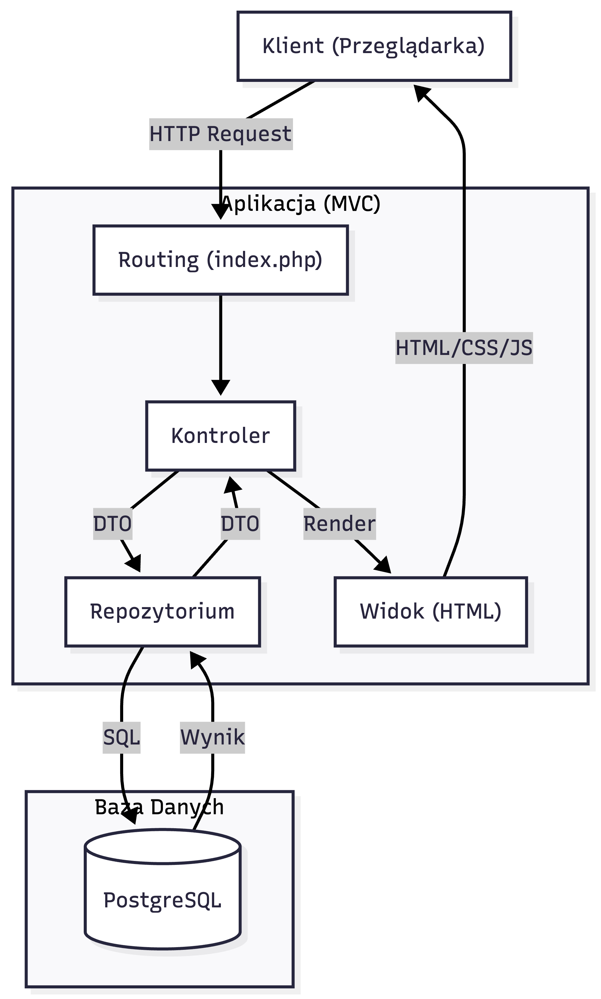
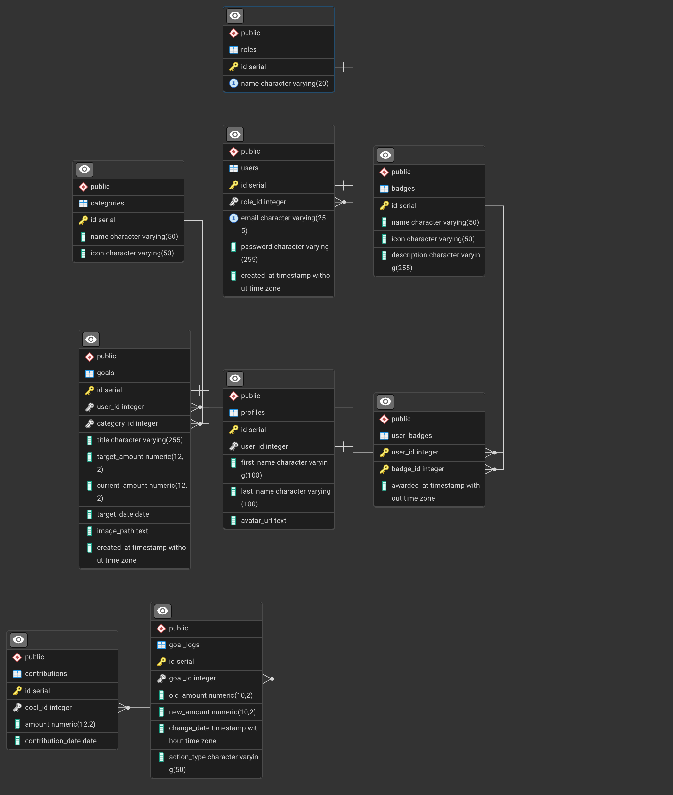
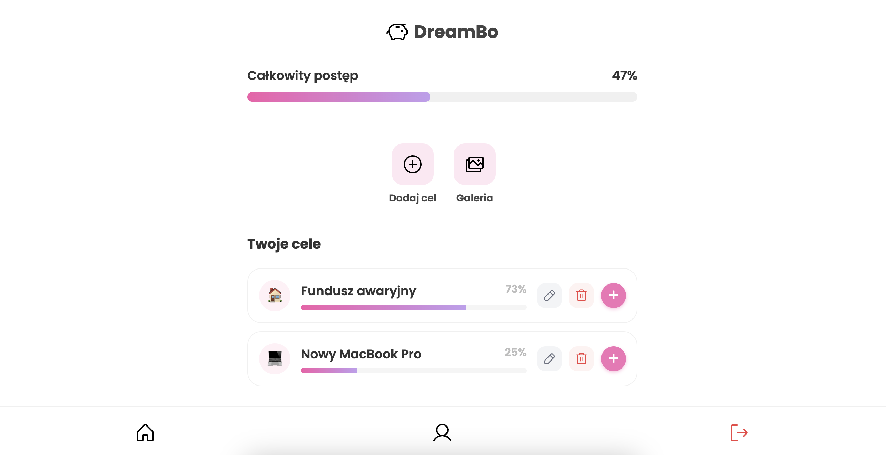
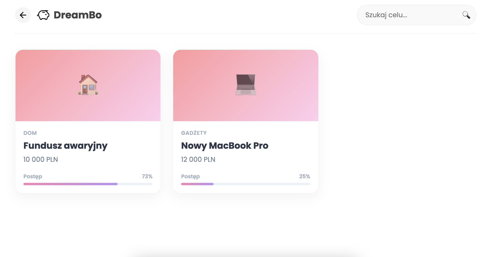
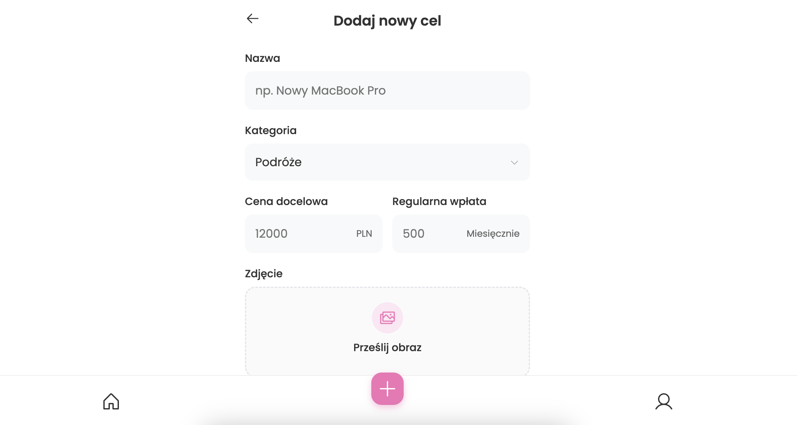
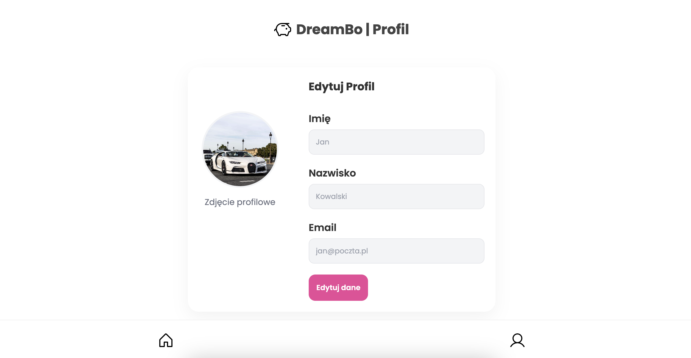
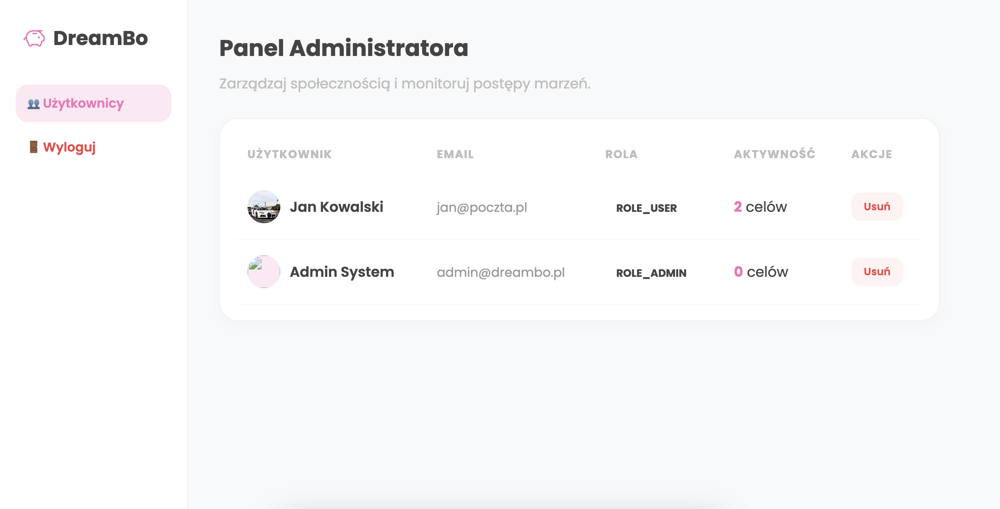

# ☁️ DreamBo - Twoje Prywatne Centrum Dowodzenia Marzeniami

> **Temat projektu:** DreamBo – Interaktywna lista życzeń z modułem wizualizacji postępów i systemem motywacyjnym.
>
> **Przedmiot:** Wstęp Do Tworzenia Aplikacji Internetowych (WDPAI)

---

## Spis treści
1. [O projekcie](#o-projekcie)
2. [Kluczowe Funkcjonalności](#kluczowe-funkcjonalności)
3. [Architektura Techniczna](#architektura-techniczna)
4. [Diagram Warstwowy](#diagram-warstwowy)
5. [Baza Danych](#baza-danych)
6. [Interfejs Użytkownika](#interfejs-użytkownika)
7. [Instrukcja Uruchomienia](#instrukcja-uruchomienia)
8. [Scenariusze Testowe](#scenariusze-testowe)
9. [Checklist](#checklist)

---

## O projekcie

**DreamBo** to aplikacja webowa typu *self-hosted*, która rozwiązuje problem "cmentarzysk marzeń" - pasywnych list życzeń, które nigdy nie są realizowane.

W przeciwieństwie do zwykłego notatnika, DreamBo umożliwia określenie konkretnych kwot i terminów, zmieniając "chciałbym" w "realizuję". Aplikacja łączy funkcjonalność wishlisty z narzędziem do oszczędzania, wizualizując, jak blisko spełnienia marzenia jesteś.

## Kluczowe Funkcjonalności

### Uwierzytelnianie i Bezpieczeństwo
* **Bezpieczna Rejestracja i Logowanie:** System oparty na sesjach PHP z hashowaniem haseł (`bcrypt`).
* **Kontrola Dostępu:** Role użytkowników (User/Admin) sterujące dostępem do zasobów.

### Zarządzanie Celami (Dream Management)
* **Tworzenie Marzeń:** Definiowanie celów z określeniem kwoty docelowej, kategorii (np. Podróże, Gadżety) i daty realizacji.
* **Symulacja Wpłat:** Możliwość rejestrowania wpłat na wirtualne konto celu.
* **Wizualizacja Postępów:** Dynamiczne paski postępu (Progress Bars) obliczane w czasie rzeczywistym na podstawie danych z bazy.
* **Edycja i Historia:** Możliwość zmiany parametrów celu wraz z pełnym audytem zmian kwot.

### Odkrywanie i Śledzenie
* **Wyszukiwarka Live:** Błyskawiczne filtrowanie celów po nazwie z wykorzystaniem **Fetch API** (bez przeładowania strony).
* **Dashboard:** Centrum dowodzenia z podsumowaniem całkowitego postępu konta i najbliższych celów.

### System Motywacyjny
* **System Odznak (Badges):** Automatyczne przyznawanie osiągnięć (np. "Początkujący", "Bogacz") po spełnieniu warunków finansowych.

### Zarządzanie Profilem
* **Personalizacja:** Edycja danych osobowych i wgrywanie awatara (obsługa plików).
* **Widok Profilu:** Prezentacja zdobytych odznak i danych użytkownika.

### Panel Administratora (Admin Dashboard)
* **Zarządzanie Użytkownikami:** Dedykowany widok dostępny tylko dla roli `ROLE_ADMIN`, prezentujący listę wszystkich zarejestrowanych użytkowników.
* **Moderacja i Usuwanie:** Możliwość trwałego usunięcia konta użytkownika. Dzięki zastosowaniu mechanizmu **CASCADE** w bazie danych, usunięcie użytkownika automatycznie i bezpiecznie czyści wszystkie powiązane z nim cele, historie wpłat oraz zdobyte odznaki.

---

## Architektura Techniczna

Aplikacja została zbudowana w oparciu o wzorzec **MVC (Model-View-Controller)**, zapewniający czystość kodu i łatwość utrzymania.

### Przepływ Systemu
1.  **Routing:** Aplikacja wykorzystuje wzorzec Front Controller. Wszystkie żądania trafiają do pliku index.php (punkt wejścia), który inicjuje sesję i obsługę błędów, a następnie przekazuje sterowanie do klasy Routing, która uruchamia odpowiedni Kontroler.
2.  **Controller:** Przetwarza dane wejściowe, weryfikuje uprawnienia i komunikuje się z Repozytorium.
3.  **Repository:** Warstwa abstrakcji bazy danych - wykonuje bezpieczne zapytania SQL (Prepared Statements).
4.  **Database:** Konteneryzowany silnik PostgreSQL przetwarza dane, uruchamia Triggery i zwraca wyniki przez Widoki.
5.  **View:** Wyrenderowany kod HTML (wraz z dołączonymi stylami CSS i skryptami JavaScript) jest wysyłany do przeglądarki, gdzie następuje finalna prezentacja interfejsu.
   
---

### Diagram Warstwowy


---

## Baza Danych

Baza danych PostgreSQL została zaprojektowana zgodnie z **3. Postacią Normalną (3NF)**, eliminując redundancję danych.

### Diagram ERD
📌 Diagram wygenerowany w pgAdmin na podstawie schematu bazy PostgreSQL uruchomionej w Dockerze.



### Zaimplementowane wymagane elementy SQL:
* **Relacje:**
    * **1:1** (`users` ↔ `profiles`) – profil użytkownika.
    * **1:N** (`users` → `goals`, `categories` → `goals`) – lista marzeń.
    * **N:M** (`users` ↔ `badges`) – system odznak (tabela łącząca `user_badges`).
      
* **Widoki (Views):**
    * `v_goals_details` – dynamiczny widok łączący marzenia z kategoriami i wyliczający % realizacji.
      
      ```sql
      CREATE OR REPLACE VIEW v_goals_details AS
      SELECT
          g.id,
          g.user_id,
          g.category_id,
          g.title,
          c.name AS category_name,
          c.icon AS category_icon, 
          g.target_amount,
          g.current_amount,
          g.target_date,
          g.image_path,            
          calculate_progress(g.current_amount, g.target_amount) AS progress_percentage
      FROM goals g
      LEFT JOIN categories c ON g.category_id = c.id;

    * `v_user_details` – agregacja statystyk użytkownika (liczba marzeń, rola).
 
      ```sql
      CREATE OR REPLACE VIEW v_user_details AS
      SELECT
          u.id,
          u.email,
          r.name AS role,
          p.first_name,
          p.last_name,
          p.avatar_url,
          COUNT(g.id) AS total_goals
      FROM users u
      JOIN roles r ON u.role_id = r.id
      LEFT JOIN profiles p ON u.id = p.user_id
      LEFT JOIN goals g ON u.id = g.user_id
      GROUP BY u.id, u.email, r.name, p.first_name, p.last_name, p.avatar_url;
      
* **Wyzwalacz (Trigger):**
    * `audit_goal_update` – automat logujący każdą zmianę kwoty marzenia do tabeli `goal_logs`.
      ```sql
      CREATE OR REPLACE FUNCTION log_goal_changes()
      RETURNS TRIGGER AS $$
      BEGIN
          IF NEW.current_amount <> OLD.current_amount THEN
              INSERT INTO goal_logs (goal_id, old_amount, new_amount, action_type)
              VALUES (NEW.id, OLD.current_amount, NEW.current_amount, 'KWOTA_ZMIENIONA');
          END IF;
          RETURN NEW;
      END;
      $$ LANGUAGE plpgsql;


      CREATE TRIGGER audit_goal_update
      AFTER UPDATE ON goals
      FOR EACH ROW
      EXECUTE FUNCTION log_goal_changes();
      
* **Funkcje PL/pgSQL:**
    * `calculate_progress()` – funkcja obliczająca postęp (używana w widokach i triggerach).
      ```sql
      CREATE OR REPLACE FUNCTION calculate_progress(
      current_val NUMERIC,
      target_val NUMERIC
      ) RETURNS INTEGER AS $$
      BEGIN
          IF target_val <= 0 THEN
              RETURN 0;
          END IF;
          RETURN LEAST(
              GREATEST(CAST((current_val / target_val) * 100 AS INTEGER), 0),
              100
          );
      END;
      $$ LANGUAGE plpgsql;
    
    * `calculate_total_user_progress()` – funkcja sumująca postęp całego konta.

      ```sql
      CREATE OR REPLACE FUNCTION calculate_total_user_progress(
      user_id_param INTEGER
      ) RETURNS INTEGER AS $$
      DECLARE
          total_target NUMERIC(12,2);
          total_current NUMERIC(12,2);
      BEGIN
          SELECT SUM(target_amount), SUM(current_amount)
          INTO total_target, total_current
          FROM goals
          WHERE user_id = user_id_param;
      
          IF total_target IS NULL OR total_target = 0 THEN
              RETURN 0;
          END IF;
      
          RETURN LEAST(
              GREATEST(CAST((total_current / total_target) * 100 AS INTEGER), 0),
              100
          );
      END;
      $$ LANGUAGE plpgsql;
      
* **Transakcje:**
    * Transakcje w klasie UserRepository zabezpieczają procesy rejestracji i edycji profilu, gwarantując atomowy zapis danych do powiązanych tabel users i profiles. Dzięki temu błąd w dowolnym kroku automatycznie wycofuje całą operację (ROLLBACK), zapewniając pełną spójność danych i eliminując ryzyko powstania niekompletnych rekordów.
 
      ```php
      // Fragment kodu z UserRepository.php
      public function createUser(UserRegistrationDTO $userDto): void {
          $db = $this->database->connect();
          try {
              $db->beginTransaction(); // Start transakcji
        
            // Krok 1: Insert do tabeli users
            $stmt = $db->prepare('INSERT INTO users ... RETURNING id');
            // ... execute ...
    
            // Krok 2: Insert do tabeli profiles
            $stmt = $db->prepare('INSERT INTO profiles ...');
            // ... execute ...
    
            $db->commit(); // Zatwierdzenie zmian
            } catch (PDOException $e) {
                if ($db->inTransaction()) {
                    $db->rollBack(); // Wycofanie w razie błędu
                }
                throw $e;
            }
      }

---

## Interfejs Użytkownika
<div align="center">





</div>

---

## Instrukcja Uruchomienia

Wymagane środowisko: **Docker** oraz **Docker Compose**.

1.  **Sklonuj repozytorium:**
    ```bash
    git clone [https://github.com/sandra4747/WDPAI-2025.git](https://github.com/sandra4747/WDPAI-2025.git)
    cd WDPAI-2025
    ```

2.  **Uruchom aplikację:**
    ```bash
    docker-compose up -d --build
    ```
    *Baza danych zostanie automatycznie zainicjalizowana strukturą i danymi testowymi (seed) z pliku `docker/db/init.sql`.*

3.  **Dostęp:**
    * **Aplikacja DreamBo:** `http://localhost:8080`
        * *Konto Admina:* `admin@dreambo.com`, `adminadmin`
        * *Konto Użytkownika:* `jan@poczta.pl`, `test1234`
    * **Baza danych (PgAdmin):** `http://localhost:5050`
        * *Email:* `admin@example.com`
        * *Hasło:* `admin`

---

## Scenariusze Testowe

### 1. Automatyczne Testy Integracyjne 
Projekt zawiera skrypt bash weryfikujący endpointy i odporność na awarie.

    ```bash
    # Uruchomienie testów
    ./tests/integration/test_endpoints.sh

### 2. Testy Jednostkowe (Unit Tests)
Projekt wykorzystuje bibliotekę **PHPUnit** do weryfikacji logiki biznesowej. Testy są uruchamiane bezpośrednio w kontenerze aplikacji, co eliminuje konieczność lokalnej konfiguracji PHP.

**Uruchomienie testów:**

    ```bash
    # Uruchomienie PHPUnit wewnątrz kontenera Docker
    docker compose exec php ./vendor/bin/phpunit tests/unit

### 3. Przykładowy scenariusz testowy (ręczny)

1. **Logowanie**
   - Wejdź na `http://localhost:8080`
   - Zaloguj się jako:  
     - admin@dreambo.com / adminadmin  
     - jan@poczta.pl / test1234  

2. **Role**
   - Jako USER nie masz dostępu do panelu admina → powinien pojawić się **403**
   - Jako ADMIN masz dostęp jedynie do panelu admina.

3. **CRUD Celów**
   - **Create:** Dodaj nowe marzenie z poziomu Dashboardu.
   - **Update (Wpłata):** Wejdź w szczegóły celu i zarejestruj wpłatę (np. 100 PLN). Pasek postępu powinien się zaktualizować.
   - **Update (Edycja):** Edytuj cel i zmień całkowitą kwotę docelową.
   - **Delete:** Usuń cel – powinien zniknąć z listy.

4. **Błąd 403**
   - Zaloguj się jako USER i spróbuj wejść na admin → **403**

5.  **Test Wyzwalacza (Trigger):**
    - Po zmianie kwoty celu (punkt 2 w sekcji CRUD), wykonaj zapytanie: `SELECT * FROM goal_logs;`
    - **Wynik:** Powinien pojawić się nowy rekord dokumentujący starą i nową kwotę.
      
6.  **Test Widoku (View):**
    - Wykonaj: `SELECT * FROM v_goals_details;`
    - **Wynik:** Powinieneś widzieć połączone dane celów wraz z nazwami kategorii i wyliczonym procentem postępu.

---

## Checklist

### Dokumentacja i Architektura
- [x] **Dokumentacja w README.md** – Pełny opis funkcjonalności, instrukcja uruchomienia i architektura.
- [x] **Architektura MVC** – Czysty podział na Model, Widok i Kontroler.
- [x] **Kod Obiektowy (OOP)** – Wykorzystanie klas, interfejsów (DTO).
- [x] **Diagram ERD** – Schemat relacji bazy danych wygenerowany w Mermaid/PNG.
- [x] **System Kontroli Wersji** – Projekt zarządzany przez **Git**.
- [x] **Temat Projektu** – **DreamBo**: Aplikacja do zarządzania celami finansowymi i marzeniami.

### Baza Danych (PostgreSQL)
- [x] **Relacyjna Baza Danych** – Tabele powiązane kluczami obcymi (`users`, `profiles`, `goals`, `categories`, `badges`, `goal_logs`).
- [x] **Skrypty Inicjalizacyjne** – Automatyczne tworzenie struktury i danych (seed) w `docker/db/init.sql`.
- [x] **Widoki (Views)** – `v_goals_details` (szczegóły celów) oraz `v_user_details` (dane użytkownika).
- [x] **Wyzwalacze (Triggers)** – `audit_goal_update` do automatycznego logowania zmian kwot w tabeli `goal_logs`.
- [x] **Funkcje PL/pgSQL** – `calculate_progress()` do obliczania procentu realizacji celu po stronie bazy.
- [x] **Transakcje (ACID)** – Obsługa atomowej rejestracji (tabela `users` + `profiles`) w `UserRepository`.
- [x] **Więzy Integralności** – Zastosowanie `ON DELETE CASCADE` przy usuwaniu użytkowników i celów.

### Frontend i Technologie Webowe
- [x] **HTML5 & CSS3** – Semantyczny kod i responsywny design.
- [x] **Czysty JavaScript (Vanilla JS)** – Obsługa interakcji bez ciężkich frameworków.
- [x] **Fetch API (AJAX)** – Asynchroniczne wyszukiwanie celów (Live Search) bez przeładowania strony.
- [x] **Dynamiczne Elementy** – Paski postępu (Progress Bars) aktualizowane na żywo.

### Bezpieczeństwo i Backend (PHP)
- [x] **PHP 8.x** – Wykorzystanie nowoczesnych funkcji języka.
- [x] **Bezpieczne Logowanie** – Hashowanie haseł algorytmem `bcrypt`.
- [x] **Zarządzanie Sesją** – Ochrona przed przejęciem sesji (Session Regeneration).
- [x] **Role Użytkowników** – Podział na **User** (zarządzanie celami) i **Admin** (zarządzanie użytkownikami).
- [x] **Ochrona przed SQL Injection** – Użycie **Prepared Statements** (PDO) we wszystkich zapytaniach.
- [x] **Separacja Logiki** – Wykorzystanie DTO (Data Transfer Objects) do przesyłania danych.
- [x] **Bezpieczna Rejestracja** – Walidacja danych wejściowych (DTO), weryfikacja unikalności emaila oraz transakcyjny zapis danych (Atomowość: Użytkownik + Profil).
- [x] **Bezpieczeństwo Sesji** – Ochrona przed atakami Session Fixation (wymuszona regeneracja ID sesji po zalogowaniu) oraz bezpieczne niszczenie danych przy wylogowaniu.

### Jakość Kodu i Testy
- [x] **Testy Jednostkowe (Unit)** – PHPUnit do testowania logiki DTO i Repozytoriów.
- [x] **Testy Integracyjne** – Skrypty Bash weryfikujące endpointy i odporność na awarie bazy (Error 500).
- [x] **Konteneryzacja** – Pełne środowisko w **Docker Compose** (Nginx, PHP, PostgreSQL, PgAdmin).    
